# Langbai 图片混淆

Windows 与 Android 双端离线图片、视频混淆/还原及 TXT Base64 转码工具。混淆图片仍是可打开的 PNG，混淆视频仍可正常播放；本机原始输出可精确还原，平台重新编码的视频可按逐帧标识近似还原。

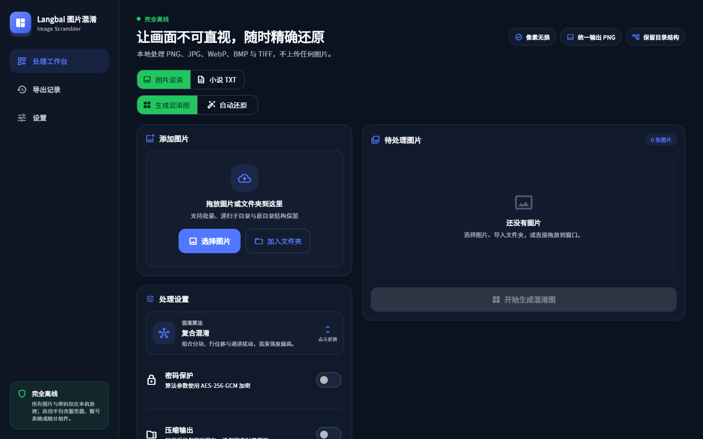

<p align="center">
  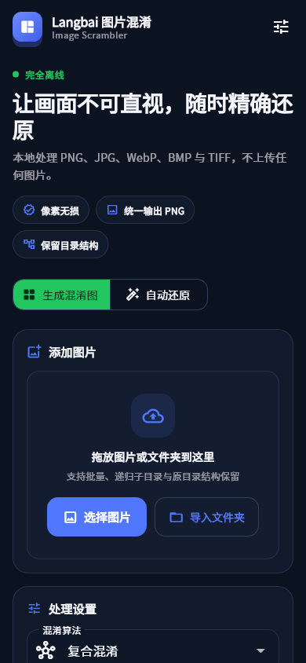
</p>

### 视频与趣味工具

<p align="center">
  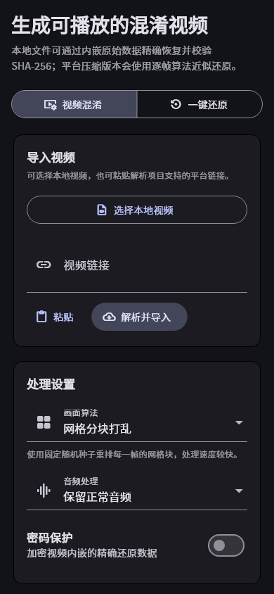
  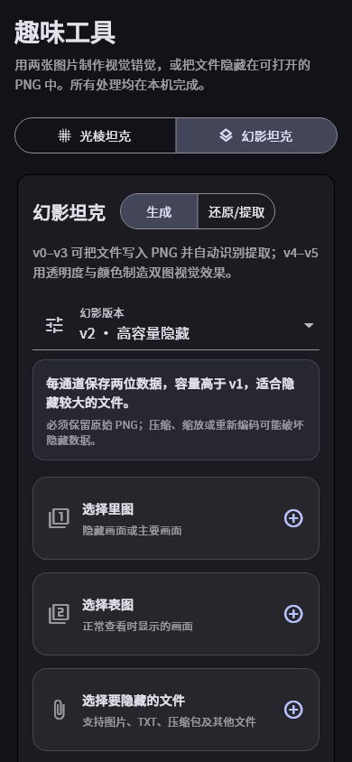
</p>

### 算法卡片选择器

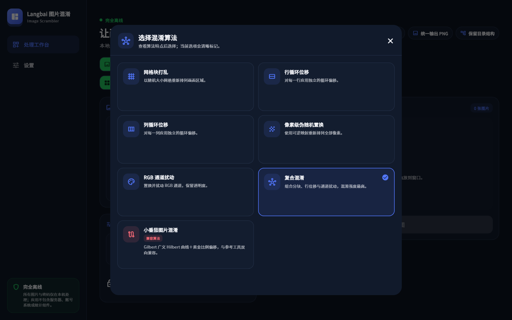

桌面端使用居中的双列卡片弹窗；Android 使用适合触控的单列底部面板。每项直接显示图标、用途说明与兼容性标记。

### 小说 TXT 工作区

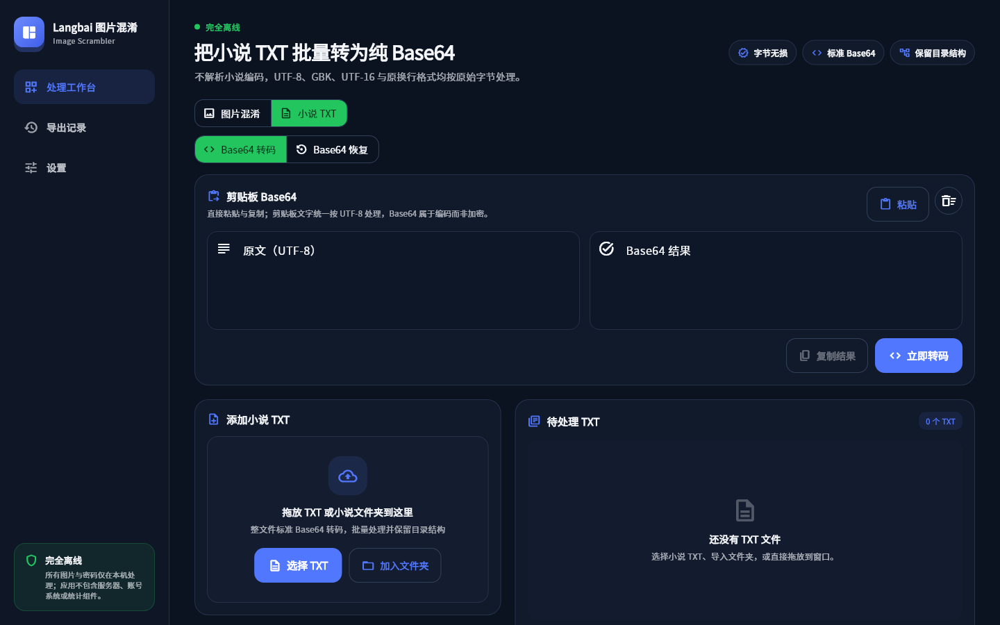

<p align="center">
  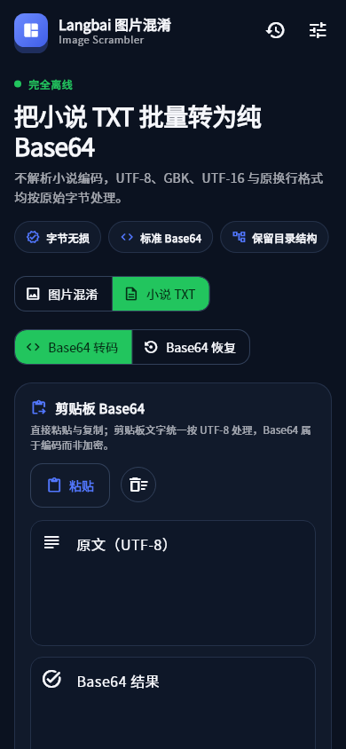
  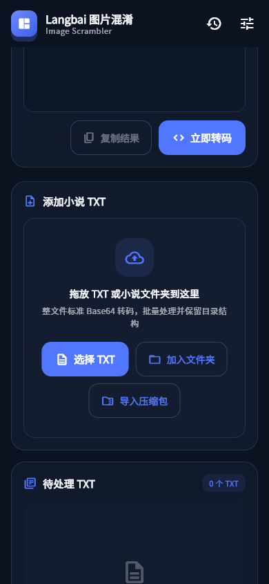
</p>

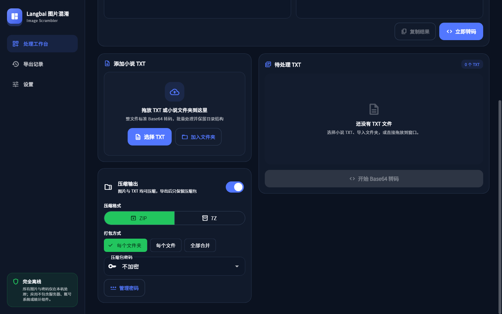

<p align="center">
  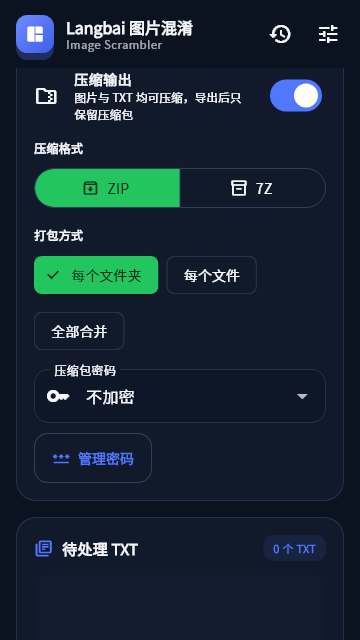
</p>

### 多文件夹与撤回记录

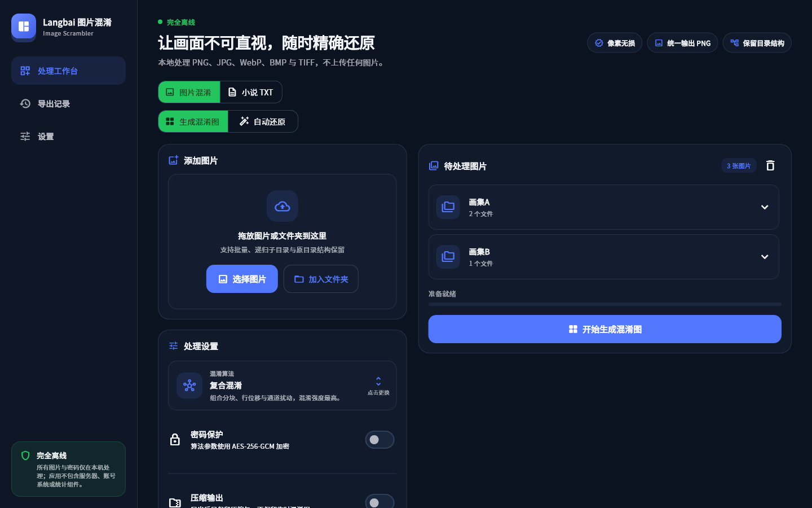

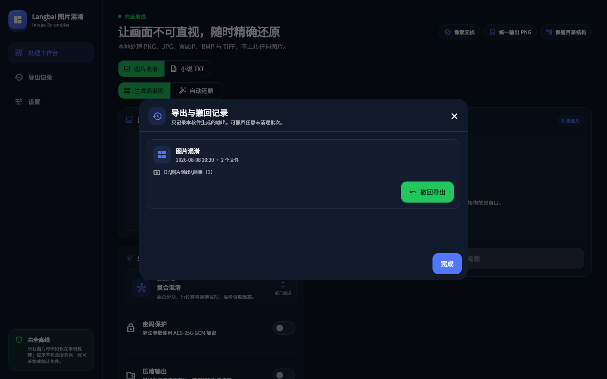

<p align="center">
  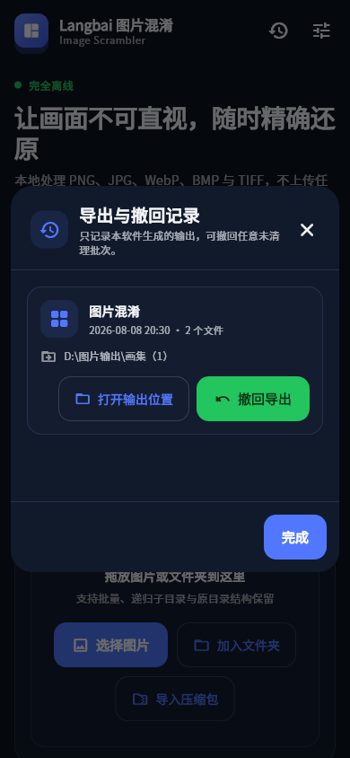
</p>

### 压缩输出、密码库与 Android 分享导入

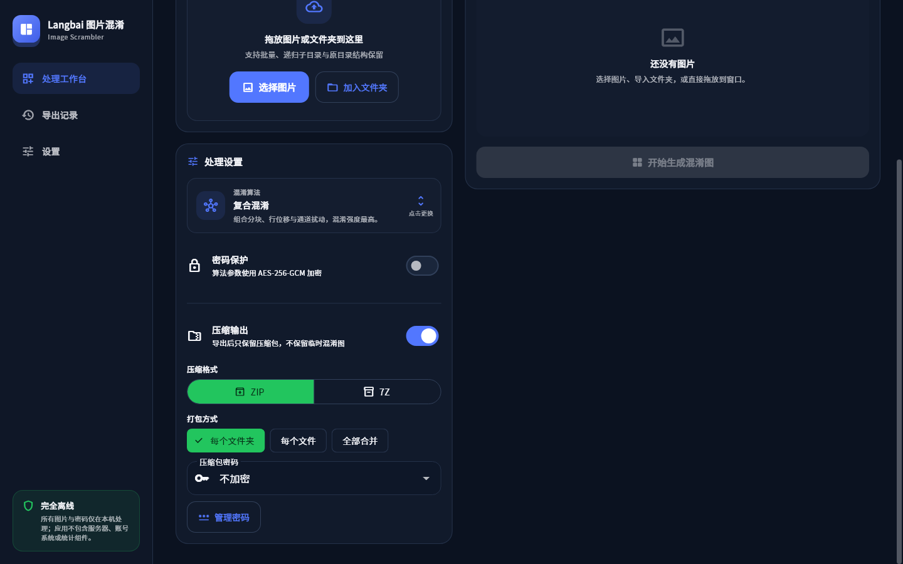

<p align="center">
  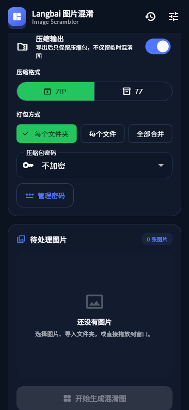
  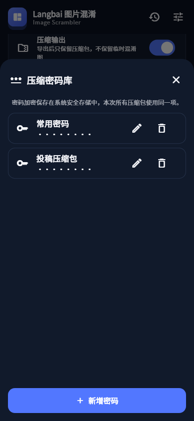
  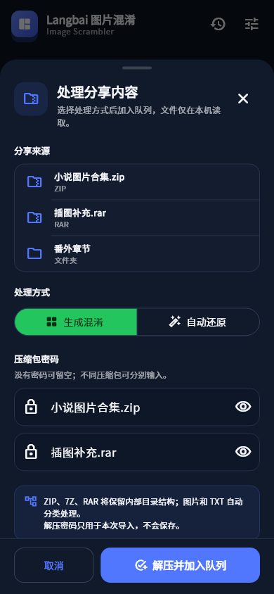
</p>

## 功能

- **可播放视频混淆**：支持 Gilbert 曲线逐帧混淆、网格分块打乱、行列循环位移；音频可保持正常，也可执行可逆混淆。
- **视频双重还原**：原始混淆 MP4 内嵌流式原视频副本与 SHA-256，可无损精确还原；平台重新编码后可自动读取算法标识或手动选择算法与种子进行近似还原。
- **链接解析导入**：视频页可粘贴解析项目支持的平台分享链接或视频直链，解析下载完成后直接进入混淆/还原流程。
- **光棱与幻影工具**：加入光棱坦克，以及幻影坦克 v0–v5；v0–v3 支持隐藏并自动提取文件，v4–v5 提供灰度/彩色双图视觉效果。
- **7 种可逆算法**：网格块打乱、行循环位移、列循环位移、像素级伪随机置换、RGB 通道扰动、复合混淆、小番茄图片混淆。
- **清晰的算法选择**：桌面端双列卡片弹窗、Android 单列底部面板，替代难以浏览的长下拉列表。
- **自动识别还原**：本软件生成的 PNG 内含私有算法标识、随机种子、版本和原像素 SHA-256；还原后自动校验。
- **可选密码保护**：使用 PBKDF2-HMAC-SHA256（210,000 次）派生密钥，以 AES-256-GCM 加密算法参数。密码不会写入文件。
- **批量与目录处理**：支持图片多选、文件夹递归导入、保留全部子目录结构。
- **多文件夹任务**：可连续加入文件夹或在 Windows 一次拖入多个文件夹；待处理区按文件夹分组并默认折叠。
- **批量并发处理**：默认根据设备性能自动并发（最多 4 张），也可手动选择同时处理 1、2、4、8 张图片。
- **小说 TXT Base64**：按原始字节执行标准 Base64 批量转码与还原，不改变原文编码、换行符或字节内容；转码与还原均保持原 TXT 文件名，同名时自动递增。
- **剪贴板 Base64**：可直接粘贴 UTF-8 原文或 Base64 内容，处理后复制全部结果；剪贴板模式与 TXT 文件批量模式相互独立。
- **Android 分享导入**：从系统分享面板接收文件、多个文件、文件夹以及 ZIP、7Z、RAR；可先输入解压密码，再选择“生成混淆”或“自动还原”。压缩包内部图片与 TXT 自动分类，其他文件跳过并统计。
- **双端压缩包导入**：Windows 与 Android 均处理 ZIP、7Z、RAR 和解压密码；ZIP 导出统一写入 UTF-8 标记，导入时兼容旧式 GBK 中文文件名，避免目录和文件名乱码。
- **只保留压缩包**：图片混淆与 TXT Base64 转码均可选 ZIP/7Z 输出，支持“每个文件夹一个”“每个文件一个”“全部合并”三种方式；临时处理文件在压缩包成功导出后立即清理。
- **压缩包加密**：ZIP 使用 WinZip AES-256，7Z 使用 7z AES；同一任务的全部压缩包统一使用一项已保存密码，也可选择不加密。
- **系统安全密码库**：可保存多个具名压缩密码并随时新增、编辑、删除和切换；Android 使用系统密钥保护，Windows 使用 Credential Manager 保护密钥。密码不会写入普通配置文件。
- **安全命名规则**：图片输出保持原文件基础名并统一为 PNG，TXT 与按文件/文件夹生成的压缩包保持原名，不追加“混淆”；同名文件或文件夹自动使用 `名称（1）`、`名称（2）` 递增，绝不覆盖已有内容。
- **导出撤回记录**：可撤回任意保留期内的导出批次；仅删除内容仍与导出时完全一致的文件，已修改文件自动跳过。
- **统一导出历史**：图片、TXT、视频、光棱坦克与幻影坦克的每次导出均记录，可打开位置并按内容哈希安全撤回。
- **还原后直达结果**：当前还原任务和每条导出历史均提供“打开输出位置”；Windows 在资源管理器中定位结果，Android 优先进入导出文件夹，单文件直接交给系统打开。
- **记录自动清理**：默认保留 7 天，可选择 1、7、30、90 天或永久；到期只清理历史记录，不删除导出文件。
- **各功能独立配置**：图片、小说 TXT、视频生成、视频还原及趣味工具分别保存模式、算法、音频、密码保护和版本参数，来回切换或重新打开软件均保持原值。
- **安全参数持久化**：图片参数密码和手动种子通过 Android 系统密钥保护或 Windows Credential Manager 保存，不写入普通配置文件；待处理文件和剪贴板内容不保存。
- **两种导出习惯**：每次询问路径，或保存固定导出文件夹。
- **Android 专项适配**：Android 8.0（API 26）起，使用系统 Storage Access Framework 取得持久目录权限，无需全盘存储权限。
- **简体/繁体中文**、深浅主题、键盘与触控响应式布局。
- **软件内更新**：检查更新不会后台下载；用户点击“立即更新”后才下载对应平台安装包并校验 SHA-256。Windows 通过原生更新助手等待旧进程退出、静默覆盖原安装路径并自动重启，失败日志保存在 `%LocalAppData%\LangbaiImageScrambler\logs`；Android 交给系统安装界面确认。
- **安装路径可选**：Windows Setup 安装向导始终显示目标文件夹页面，可使用默认目录或点击“浏览”选择其他路径；以后软件内更新会沿用该路径。
- **更新助手过渡说明**：`v1.2.4` 及更早的 Windows 版本尚未内置原生更新助手，升级到 `v1.2.5` 时需手动运行一次新版 Setup；从 `v1.2.5` 开始，后续软件内更新会自动安装并重启。
- **GitHub 项目入口**：设置页可直接打开本项目公开主页。
- **本地处理**：图片、密码和算法参数均在本机处理；检查或下载更新时访问 GitHub Releases。

## 无损边界

逐像素精确还原要求使用本软件输出的原始 PNG。微信、QQ、B站或其他平台若对图片执行 JPEG 压缩、缩放、裁剪或重新编码，原像素已经改变，校验会失败。

“小番茄图片混淆”与参考工具在 Gilbert 曲线像素映射上双向兼容。参考工具若输出 JPEG，其有损编码本身不满足逐像素无损；本软件自身的 PNG 往返保持精确。

## 使用

1. 在顶部选择“图片混淆”或“小说 TXT”工作区，再选择生成/还原模式。
2. TXT 工作区可直接粘贴并复制 UTF-8 文本；导入 TXT 文件时自动进入保留原始字节的文件批量处理流程。
3. 选择图片或 TXT、导入文件夹/压缩包，或在 Windows 拖入文件/文件夹。
4. 图片生成时选择算法，可按需启用图片参数密码；图片还原默认自动识别。TXT 工作区固定使用标准 Base64，不使用密码。
5. 如需压缩，开启“压缩输出”，选择 ZIP/7Z、打包方式及本次统一使用的密码；导出结果中只留下压缩包。
6. 点击主按钮并选择导出位置；还原完成后可直接点击“打开输出位置”。
7. 识别不到外部小番茄图片时，手动选择“小番茄图片混淆”。其他无标识算法需要同时提供生成时的随机种子。

文件夹导入会递归处理支持的文件，并在导出位置使用原文件夹名作为根目录，内部子目录结构保持不变。多个文件夹分别保留各自名称；重名时自动追加全角括号数字。

## 构建

项目使用 Flutter 3.44 / Dart 3.12。

```powershell
flutter pub get
flutter analyze
flutter test
flutter build apk --release
flutter build windows --release
```

Android 最低版本为 API 26，固定 `applicationId`：`com.langbai.imagescrambler`。

## Android 签名与升级

正式更新必须永久复用同一个 keystore、alias 和 `applicationId`。`android/key.properties` 已加入 `.gitignore`，公开仓库不包含私钥。配置格式：

```properties
storePassword=YOUR_STORE_PASSWORD
keyPassword=YOUR_KEY_PASSWORD
keyAlias=langbai-release
storeFile=C:/secure/location/langbai-image-scrambler-release.jks
```

当前正式发布密钥由项目所有者离线保管。详见 [发布说明](docs/SIGNING_AND_RELEASE.md)。

## 测试

- 七种算法对非方形 RGBA 图执行正向/逆向逐字节对比。
- 视频容器覆盖公开/密码模式、超过单加密块的流式载荷、真实 MP4 可播放校验及 SHA-256 精确还原。
- 光棱/幻影处理覆盖 v0–v3 隐藏文件精确往返、v4–v5 PNG 生成及错误版本检测。
- 小番茄算法与参考 Python 实现的固定映射夹具对比。
- PNG 自动识别、AES-GCM 正确密码、错误密码、像素 SHA-256 校验。
- TXT 原始字节 Base64 往返、剪贴板 UTF-8 往返、带换行 Base64 兼容、无效文本错误处理、原文件与文件夹名、子目录及压缩输出保留。
- 图片原名输出、文件/文件夹同名递增、并发同名写入不覆盖。
- 1/2/4/8 工作者并发调度、导出记录持久化、7 天清理与修改文件撤回保护。
- 图片/TXT 双配置档案切换、重启恢复、旧版全局配置迁移，以及图片密码与手动种子的系统安全存储。
- 多文件夹导入、追加任务与文件夹分组默认折叠。
- 图片/TXT 的 ZIP AES 与 Windows/Android 7Z 加密读写、错误密码、目录结构和“只导出压缩包”流程。
- Windows 与 Android ZIP/7Z/RAR 真实夹具解压、旧式 GBK ZIP 中文名、错误密码、混合文件过滤与路径越界防护。
- 1440×900 Windows、390×844 与 360×640 Android 工作台、视频页、趣味工具、压缩设置、密码库、分享导入、算法选择器和 TXT 工作区黄金图布局检查；另覆盖 Android 横屏与 1.3 倍文字。

## 许可证

项目源代码采用 [MIT License](LICENSE)。小番茄、cryptoimage 兼容实现、FFmpeg 与字体来源及各自许可证见 [THIRD_PARTY_NOTICES.md](THIRD_PARTY_NOTICES.md)。
